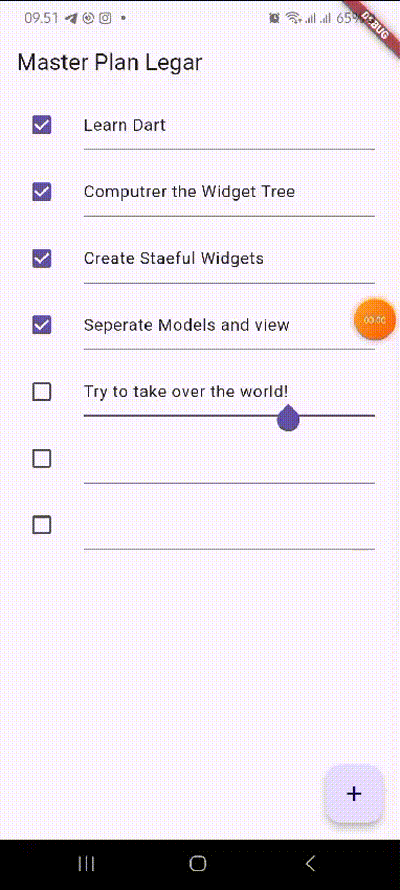
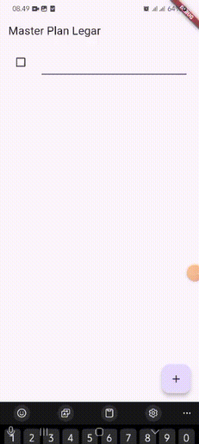
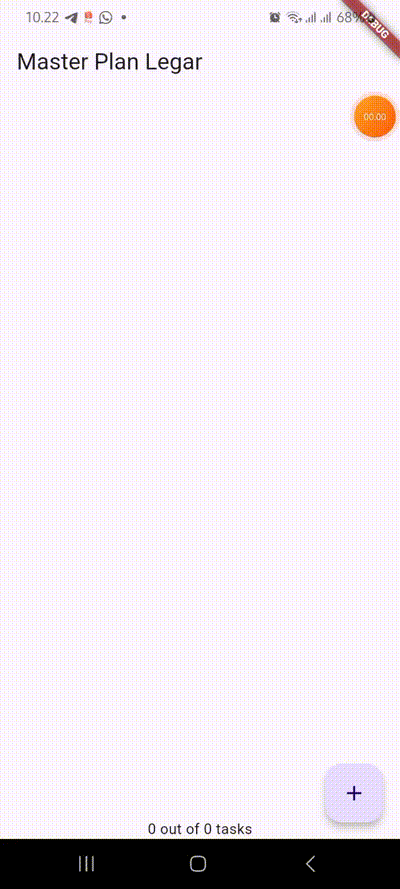

# master_plan

# praktikum 1

1. 
   Penjelasan :

2. maksud dari langkah 4 adalah untuk membuat proses impor akan lebih ringkas seiring berkembangnya aplikasi.

3. Variabel plan dalam kode tersebut berfungsi untuk menyimpan dan mengelola data rencana yang ditampilkan dalam antarmuka pengguna, memungkinkan pengelolaan state yang efektif dalam StatefulWidget. Dengan mendeklarasikannya sebagai konstanta, memastikan bahwa objek tersebut tidak dapat diubah setelah dibuat, yang menjaga integritas data dan mengurangi risiko kesalahan. Selain itu, penggunaan konstanta meningkatkan efisiensi aplikasi karena Flutter dapat mengoptimalkan rendering widget yang menggunakan nilai tetap, sehingga memperbaiki performa dan stabilitas aplikasi secara keseluruhan.

4. 
   Penjelasan :hasil dari langkah 9 memungkinkan pengguna untuk berinteraksi dengan setiap tugas dalam daftar rencana, baik dengan menandai tugas sebagai selesai melalui checkbox maupun dengan mengedit deskripsi tugas.

5. langkah 11 dan 12 berfungsi untuk meningkatkan interaksi pengguna dengan aplikasi melalui pengelolaan perilaku scroll dan keyboard. Metode initState() memungkinkan inisialisasi yang tepat dari state dan pengaturan listener untuk mengelola fokus, sementara pengaturan ScrollController dan keyboardDismissBehavior pada ListView memastikan bahwa pengalaman pengguna tetap responsif dan intuitif saat berinteraksi dengan daftar tugas.

# praktikum 2

1. 
   Penjelasan : Hasil akhir dari praktikum 2 tersebut setelah mengikuti langkah langkah, user akan dapat membuat list plan, dan di bagian footer akan meanmpilkan jumlah plan yang di cheklist dan yang belum

2. InheritedWidget adalah kelas dasar yang digunakan oleh PlanProvider. Dengan menggunakan InheritedNotifier, PlanProvider tidak hanya dapat membagikan data, tetapi juga dapat memberi tahu widget yang bergantung padanya ketika data tersebut berubah. Ini membuat pengelolaan state menjadi lebih efisien dan terorganisir dalam aplikasi Flutter.

3. Method completedCount : Method ini adalah sebuah getter yang menghitung jumlah tugas yang telah diselesaikan dalam daftar tasks. Di sini, tasks adalah koleksi dari objek tugas (task), dan setiap tugas memiliki properti complete yang menunjukkan apakah tugas tersebut telah diselesaikan atau belum.
   Method completenessMessage: Method ini juga merupakan sebuah getter yang menyajikan pesan string yang menunjukkan jumlah tugas yang telah diselesaikan dibandingkan dengan total jumlah tugas. Dengan memanggil completedCount, method ini menggabungkan hasilnya dengan total jumlah tugas (tasks.length) untuk membentuk pesan yang informatif.
