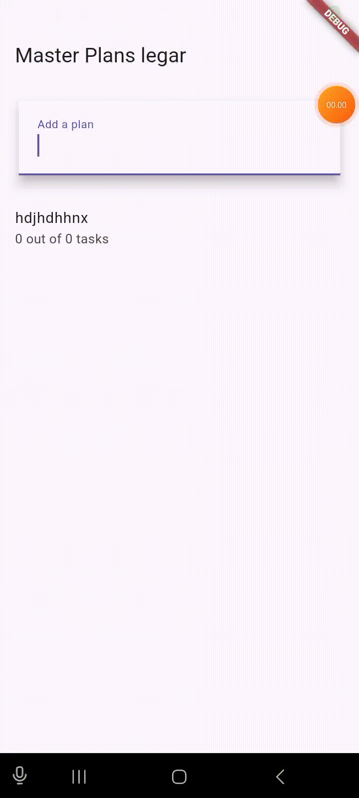

# master_plan

# praktikum 1

1. 
   Penjelasan :

2. maksud dari langkah 4 adalah untuk membuat proses impor akan lebih ringkas seiring berkembangnya aplikasi.

3. Variabel plan dalam kode tersebut berfungsi untuk menyimpan dan mengelola data rencana yang ditampilkan dalam antarmuka pengguna, memungkinkan pengelolaan state yang efektif dalam StatefulWidget. Dengan mendeklarasikannya sebagai konstanta, memastikan bahwa objek tersebut tidak dapat diubah setelah dibuat, yang menjaga integritas data dan mengurangi risiko kesalahan. Selain itu, penggunaan konstanta meningkatkan efisiensi aplikasi karena Flutter dapat mengoptimalkan rendering widget yang menggunakan nilai tetap, sehingga memperbaiki performa dan stabilitas aplikasi secara keseluruhan.

4. 
   Penjelasan :hasil dari langkah 9 memungkinkan pengguna untuk berinteraksi dengan setiap tugas dalam daftar rencana, baik dengan menandai tugas sebagai selesai melalui checkbox maupun dengan mengedit deskripsi tugas.

5. langkah 11 dan 12 berfungsi untuk meningkatkan interaksi pengguna dengan aplikasi melalui pengelolaan perilaku scroll dan keyboard. Metode initState() memungkinkan inisialisasi yang tepat dari state dan pengaturan listener untuk mengelola fokus, sementara pengaturan ScrollController dan keyboardDismissBehavior pada ListView memastikan bahwa pengalaman pengguna tetap responsif dan intuitif saat berinteraksi dengan daftar tugas.

# praktikum 2

1. 
   Penjelasan : Hasil akhir dari praktikum 2 tersebut setelah mengikuti langkah langkah, user akan dapat membuat list plan, dan di bagian footer akan meanmpilkan jumlah plan yang di cheklist dan yang belum

2. InheritedWidget adalah kelas dasar yang digunakan oleh PlanProvider. Dengan menggunakan InheritedNotifier, PlanProvider tidak hanya dapat membagikan data, tetapi juga dapat memberi tahu widget yang bergantung padanya ketika data tersebut berubah. Ini membuat pengelolaan state menjadi lebih efisien dan terorganisir dalam aplikasi Flutter.

3. Method completedCount : Method ini adalah sebuah getter yang menghitung jumlah tugas yang telah diselesaikan dalam daftar tasks. Di sini, tasks adalah koleksi dari objek tugas (task), dan setiap tugas memiliki properti complete yang menunjukkan apakah tugas tersebut telah diselesaikan atau belum.
   Method completenessMessage: Method ini juga merupakan sebuah getter yang menyajikan pesan string yang menunjukkan jumlah tugas yang telah diselesaikan dibandingkan dengan total jumlah tugas. Dengan memanggil completedCount, method ini menggabungkan hasilnya dengan total jumlah tugas (tasks.length) untuk membentuk pesan yang informatif.

# praktikum 3

1. 
Penjelasan : membuat aplikasi manajemen waktu sehari hari

2. Gambar tersebut menunjukkan diagram navigasi antar halaman (screen navigation) dalam pengembangan aplikasi menggunakan Flutter/Material Design. Mari saya jelaskan maksudnya:

Sisi Kiri (Halaman Awal):

Dimulai dengan MaterialApp sebagai root aplikasi
Menggunakan PlanProvider untuk manajemen state
Memiliki PlanCreatorScreen yang berisi:
Column sebagai layout utama
TextField untuk input
Expanded dengan ListView di dalamnya
Sisi Kanan (Halaman Tujuan):

Juga dimulai dengan MaterialApp
Menggunakan PlanScreen sebagai halaman utama
Memiliki Scaffold sebagai struktur dasar
Column yang berisi:
Expanded dengan ListView
SafeArea dengan Text di dalamnya
Navigator Push:

Tanda panah di tengah menunjukkan navigasi menggunakan Navigator.push()
Ini menandakan perpindahan dari halaman pembuatan plan (kiri) ke halaman detail plan (kanan)
Diagram ini menggambarkan arsitektur navigasi aplikasi dimana pengguna dapat membuat sebuah plan di halaman pertama, kemudian berpindah ke halaman kedua untuk melihat detail atau hasil dari plan tersebut. Struktur ini umum digunakan dalam pengembangan aplikasi Flutter untuk mengelola navigasi antar halaman dengan efektif.

3. Langkah 1: Edit PlanProvider Perhatikan kode berikut, edit class PlanProvider sehingga dapat menangani List Plan. class PlanProvider extends InheritedNotifier<ValueNotifier<List>> { pasted AD jawaban nomor 3

Berdasarkan Langkah 14 pada praktikum, saya akan menjelaskan aplikasi yang dibuat:

Aplikasi ini adalah sebuah "Master Plans" atau aplikasi pengelola rencana/tugas dengan fitur sebagai berikut:

Tampilan Awal (PlanCreatorScreen): Memiliki AppBar dengan judul "Master Plans legar" TextField untuk menambahkan rencana baru Area tampilan daftar rencana Fitur-fitur Utama: Dapat menambahkan rencana baru melalui TextField Jika belum ada rencana, menampilkan ikon note dan pesan "Anda belum memiliki rencana apapun" Menampilkan daftar rencana dalam bentuk ListView Setiap item rencana menampilkan: Nama rencana (title) Pesan kelengkapan rencana (subtitle) Dapat mengklik rencana untuk melihat detail dan mengelola tasks Navigasi: Ketika mengklik sebuah rencana, aplikasi akan berpindah ke PlanScreen PlanScreen menampilkan detail rencana dan memungkinkan penambahan/pengelolaan tasks State Management: Menggunakan PlanProvider untuk mengelola state Dapat memperbarui dan menyimpan daftar rencana State dipertahankan antar screen menggunakan InheritedNotifier

